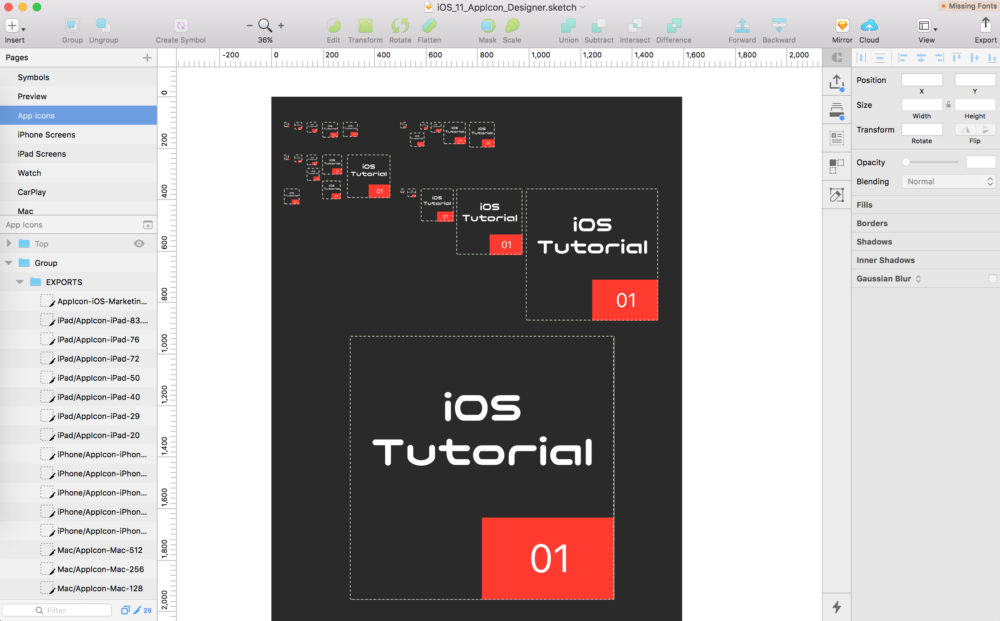

# Sketch: Apple Icon Generator

Description:



Quickly generate your icons for all of your Apple Development needs. Sketch is an awesome application, but the default iOS icon template is not powerful enough to be "Swifty" for every project.  This is a boilerplate file that gives designers and developers a quick start on getting their icons ready for import into the xcassets folder.


## Getting Started

These instructions will get you a copy of the project up and running on your local machine for development and testing purposes. See deployment for notes on how to deploy the project on a live system.

### Prerequisites

You need Sketch to open these files.


### Installing

Clone the repo from terminal or download as a zip file.

```
git clone https://github.com/markfilter/sketch-ios-icon-generator.git
```

### How to use
1. Download or clone the repo.
2. Open the file up in Sketch.
3. Find the symbols page, add your designs in the symbol area.
4. View the changes dynamically throughout the rest of the page structure.
5. Export into a folder and drag & drop into your xcassets folder.

### Note
Unfortunately, Xcode is not smart enough to place all of the images in the correct location, so, you may need to manually drag some of the images into the correct location.

> **Updated for iOS 11**
> The latest update includes the App Icon size required for Apple Marketing; 1024 x 1024.


## Built With

* [Sketch](https://www.sketchapp.com) - The design software used


## Authors

* **Mark Filter** - *Initial work* - [Website](https://markzfilter.com)


## License

This project is licensed under the MIT License - see the [LICENSE.md](LICENSE.md) file for details
